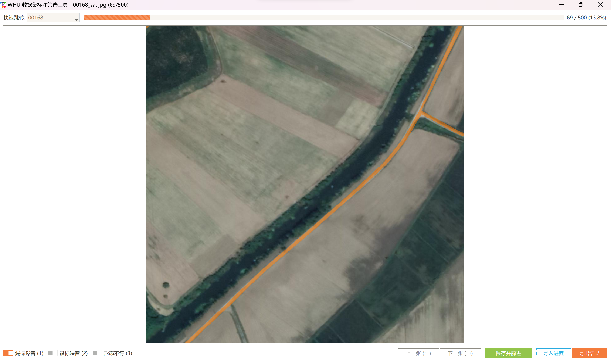

# WHU-RuR+数据集专用标注与筛选工具 🚀

一款专为 **WHU-RuR+ (2025) 农村道路数据集** 设计的桌面应用，旨在提供一个高效、美观、易用的图像与掩码标注筛选工作流。

-----

## 📜 简介

在处理大规模语义分割数据集时，快速地浏览、检验和筛选标注质量是一项耗时但至关重要的任务。本工具的开发完全围绕 **WHU-RuR+ 数据集** 的特性，通过提供一个现代化的图形界面，让研究者能够轻松地同步查看原始图像（`sat`）和对应的像素级标注掩码（`mask`），并对其中存在的各类噪声（如漏标、错标）进行分类和记录。

WHU-RuR+ 数据集专注于农村道路提取，包含了覆盖8个国家的36,098对高分辨率（1024×1024）图像。为了对该数据集的标注质量进行初步量化评估，我们从原数据集中**随机抽取了500张图像**，使用本工具进行了标注筛选和分析。本工具的交互式查看和噪声标注功能，可以极大地加速对这一大规模数据集的预处理和分析流程。

## ✨ 主要功能

  * **🗂️ 自动加载**: 启动时自动加载当前目录下的 `sat` 和 `mask` 文件夹，无需手动选择。
  * **🎭 智能叠加**: 自动将 `mask` 图像中的0像素值（通常为背景）处理为透明，并将非0像素值以醒目的颜色叠加在 `sat` 图像上。
  * **🔍 交互式查看**:
      * **无级缩放**: 使用鼠标滚轮，以指针位置为中心进行流畅的图像缩放。
      * **自由拖拽**: 在图像放大后，按住鼠标左键可自由拖动平移图像。
  * **⚡ 高效导航**:
      * 通过“上一张”/“下一张”按钮或快捷键快速切换。
      * 顶部的下拉菜单式**文件目录**，可直接跳转到任意一张指定的图像。
  * **🏷️ 噪声分类**: 通过复选框和快捷键，为每张图像标注“漏标噪音”、“错标噪音”、“形态不符”等多种标签。
  * **💾 进度管理**:
      * 可随时将当前的标注进度**导出**为一个易于解析的 `.txt` 文件。
      * 支持**导入**之前保存的进度文件，实现断点续传。
      * **智能续传**: 导入进度后，程序会自动跳转到工作列表中第一个尚未标注的图像。
  * **⌨️ 全功能快捷键**: 所有核心操作均支持键盘快捷键，实现高效的“键盘流”操作。

-----

## 🖥️ 界面说明与效果图

工具界面主要分为三个部分，布局清晰，操作直观。

  * **顶部控制栏**:
      * **快速跳转**: 下拉菜单，列出所有图像ID，可快速跳转。
      * **进度条**: 可视化显示当前浏览进度。
      * **进度文本**: 精确显示“当前/总数”和百分比。
  * **中部画布**:
      * 核心显示区域，用于展示卫星图像与掩码的叠加效果。
      * 支持缩放和拖拽操作。
  * **底部控制栏**:
      * **噪声标注区**: 用于对当前掩码质量进行分类标注。
      * **功能按钮区**: 提供“上/下一张”、“保存”、“导入/导出”等核心功能。




-----

## ⌨️ 快捷键

为了最大化效率，工具内置了丰富的快捷键：

| 按键 | 功能 |
| :--- | :--- |
| `←` (左方向键) | 切换到 **上一张** 图片 |
| `→` (右方向键) | 切换到 **下一张** 图片 |
| `Space` (空格键) | **保存** 当前分类并自动切换到下一张 |
| `1` | 切换 **“漏标噪音”** 标签 |
| `2` | 切换 **“错标噪音”** 标签 |
| `3` | 切换 **“形态不符”** 标签 |
| `Q` | **显示/隐藏** 掩码（Mask）叠加层 |

-----

## 🛠️ 使用步骤

#### 1\. 环境准备

确保您的 Python 环境中已安装所有必需的库。

```bash
pip install ttkbootstrap Pillow matplotlib
```

#### 2\. 准备数据

请按照下面的结构组织您的项目文件夹。将 `main_app.py` 脚本（即主标注工具）和 `noiseDistribution.py` 脚本（分析脚本）放在根目录。

```
/您的项目目录/
    ├── sat/              # 存放您的 .jpg 或 .png 卫星图像
    │   ├── 00001_sat.jpg
    │   └── ...
    ├── mask/             # 存放您的 .png 掩码文件
    │   ├── 00001_mask.png
    │   └── ...
    ├── main_app.py      # 主程序脚本
    └── noiseDistribution.py # 噪声分析脚本
```

#### 3\. 运行程序

打开终端，进入项目根目录，然后运行：

```bash
python main_app.py
```

#### 4\. 开始标注

  * 使用鼠标或快捷键浏览图片。
  * 根据掩码质量，点击对应的复选框或按 `1`, `2`, `3` 进行标注。
  * 使用 `Q` 键随时切换掩码的显示，方便对比。
  * 使用鼠标滚轮和左键拖拽，仔细检查图像细节。

#### 5\. 导入/导出进度

  * 点击 **“导出结果”** 按钮，将您的所有标注工作保存到一个 `annotations.txt` 文件中。建议您定期保存。
  * 当您关闭程序后想继续工作时，再次运行程序，点击 **“导入进度”** 按钮，选择之前导出的 `.txt` 文件即可恢复所有标注状态，并自动跳转到您上次中断的地方。

-----

## 📊 噪声分布可视化脚本说明

在您使用标注工具完成筛选并导出 `annotations.txt` 文件后，为了对标注噪声有一个宏观、量化的认识，项目提供了一个辅助分析脚本 `noiseDistribution.py`。

**功能**:

  * 该脚本会自动读取 `annotations.txt` 文件的内容。
  * 统计 “漏标噪音 (1)”、“错标噪音 (2)”、“形态不符 (3)” 这三类标签在所有标注中出现的总次数。
  * 基于您在脚本中设定的样本总数（例如500），计算每个噪声类别所占的百分比。
  * 生成一个名为 `noise_distribution_percentage.png` 的高质量直方图，使用统一的暖色调对统计结果进行可视化，图中清晰地标注了各类别的具体数量和百分比。

**使用方法**:

1.  确保 `noiseDistribution.py` 与导出的 `annotations.txt` 文件在同一目录下。
2.  （可选）根据您的实际抽样总数，修改脚本顶部的 `TOTAL_IMAGES` 变量。
3.  在终端中运行脚本：
    ```bash
    python noiseDistribution.py
    ```
4.  运行结束后，即可在同目录下找到生成的图表图片。

-----

## ⚠️ 注意事项

  * **数据结构**: 本工具严格依赖于 `sat` 和 `mask` 这两个文件夹名称。请确保您的原始图像和掩码分别存放在这两个文件夹中。
  * **文件命名**: 程序通过文件名前缀的数字ID来匹配 `sat` 和 `mask` 图像对（例如 `00100_sat.jpg` 和 `00100_mask.png`）。不符合此命名规范的文件将被忽略。
  * **性能**: 处理超高分辨率（例如大于 4K）的图像时，缩放和拖拽操作可能会消耗较多内存和CPU资源。建议在主流配置的电脑上运行以获得最佳体验。
  * **保存进度**: 本工具的标注结果保存在内存中，关闭程序前请务必点击 **“导出结果”** 按钮将工作进度保存到文件中，以免数据丢失。